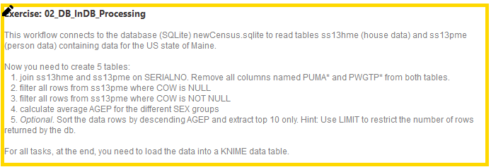
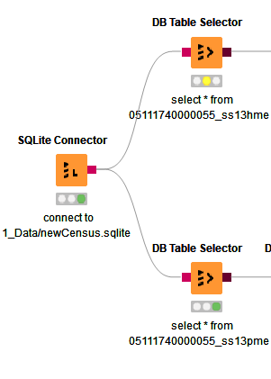
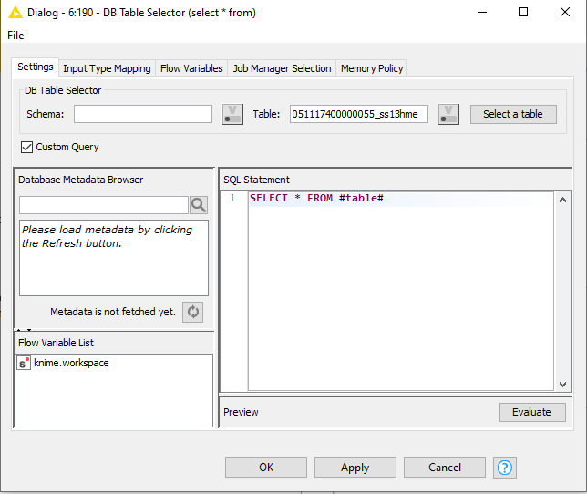
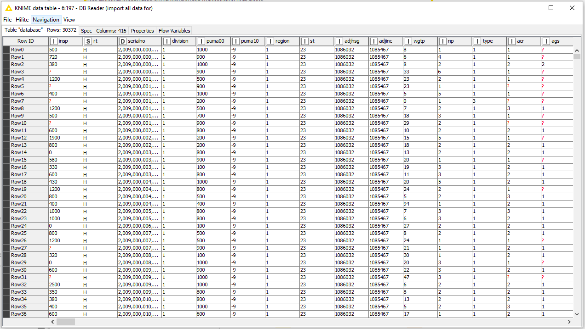
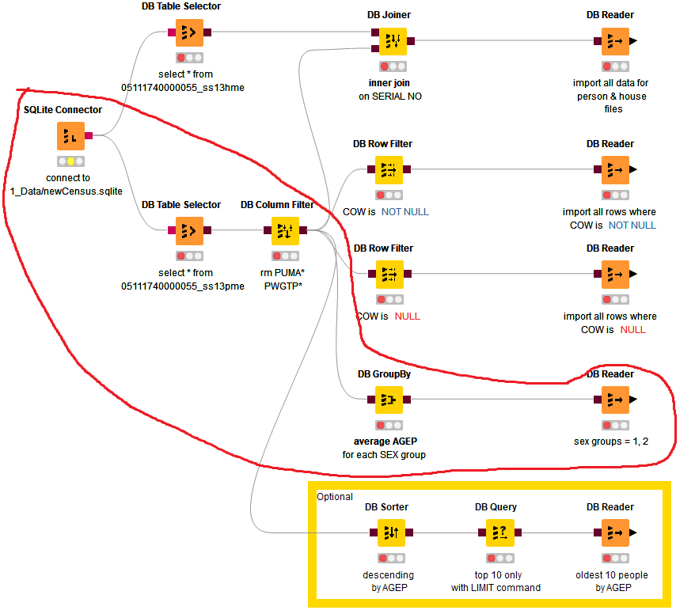
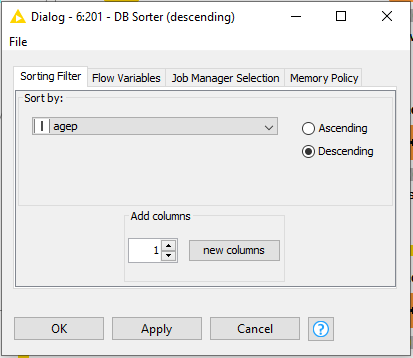
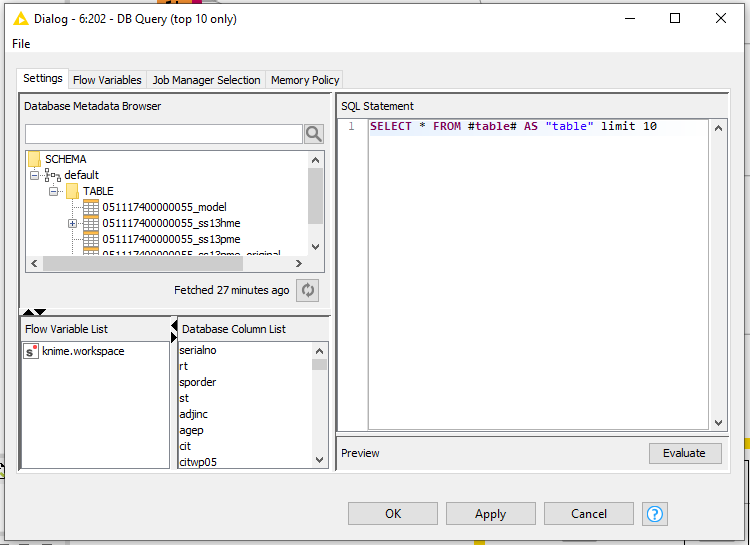

# 02_DB_inDB_Processing Exercise
  
  Deskripsi:
  
  Terdapat 5 problem yang harus dikerjakan dalam satu workflow
  
  
  
  Kurang lebih workflow utamanya seperti ini
  
  
  
## Preparation

  Untuk persiapan data yang akan kita gunanakan, menggunakan 2 table selector yang pertama untuk table 05111740000055_ss13hme dan table 05111740000055_ss13pme
  
  
  
  Konfigurasi untuk table selector 05111740000055_ss13hme
  
  
  
  Konfigurasi untuk table selector 05111740000055_ss13pme
  
  
  
### Problem 1 : join ss13hme and ss13pme on SERIALNO. Remove all columns named PUMA* and PWGTP* from both tables.

  Untuk workflownya kurang lebih seperti itu
  
  
  
  Selanjutnya kita filter kolom dengan prefix PUMA* dan PWGTP* untuk dihilangkan
  
  
  
  Selanjutnya kita join kedua table tersebut
  
  
  
  Data table view setelah kita join kedua table
  
  
  
### Problem 2 : filter all rows from ss13pme where COW is NULL.

  Workflownya kurag lebih seperti ini
  
  
  
  Lalu kita filter semua row pada kolom Cow yang NULL
  
  
  
  Hasil dari filter pada problem 2
  
  
  
### Problem 3 : filter all rows from ss13pme where COW is NOT NULL.

  Workflow nya kurang lebih seperti ini
  
  
  
  Untuk filter semua row pada kolom Cow yang tidak NULL
  
  
  
  Hasli filter dari Problem 3
  
  
  
### Problem 4 : calculate average AGEP for the different SEX groups.

  Kurang Lebih workflownya seperti ini
  
  
  
  selanjutnya kita tambahkan GroupBy berdasarkan Sex
  
  
  
  Selanjutnya kita tambah agregasi AVG untuk kolom Agep lalu apply
  
  
  
  Hasil data table Problem 4 setelah kita view
  
  
  
### Problem 5 : Optional. Sort the data rows by descending AGEP and extract top 10 only. Hint: Use LIMIT to restrict the number of rows returned by the db.

  Kurang Lebih workflownya seperti ini
  
  
  
  Lalu kita Sort Descending Berdasarkan Kolom Agep
  
  
  
  Setelah itu kita tambahkan Query, untuk mendapatkan data sort sebanyak 10 baris dengan menggunakan Limit 10
  
  
  
  Hasilnya akan seperti ini
  
  
  
  
