# Big Data : Evaluasi Akhir Semester
# Monthly Beer Production

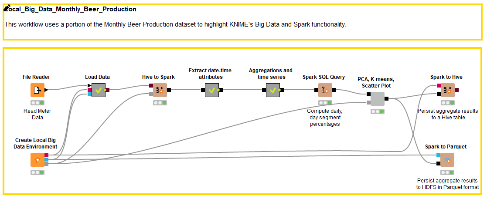

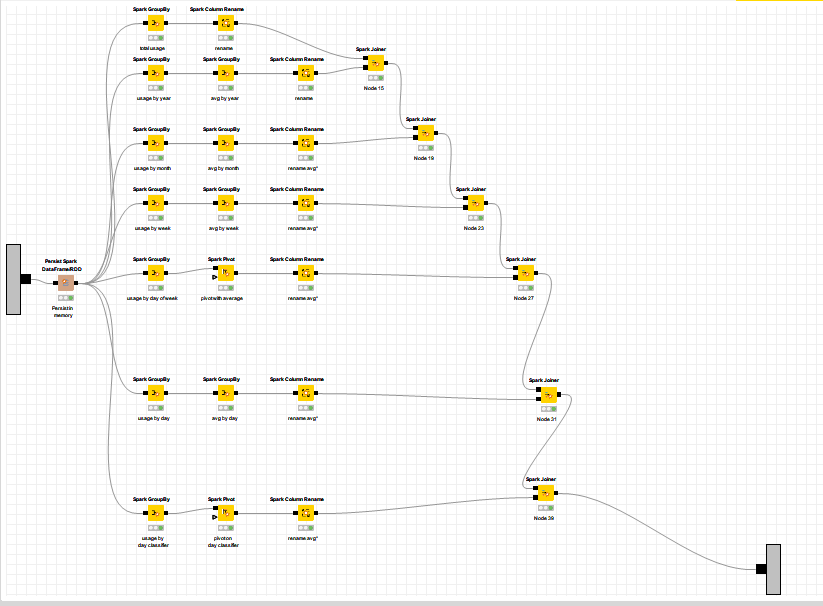

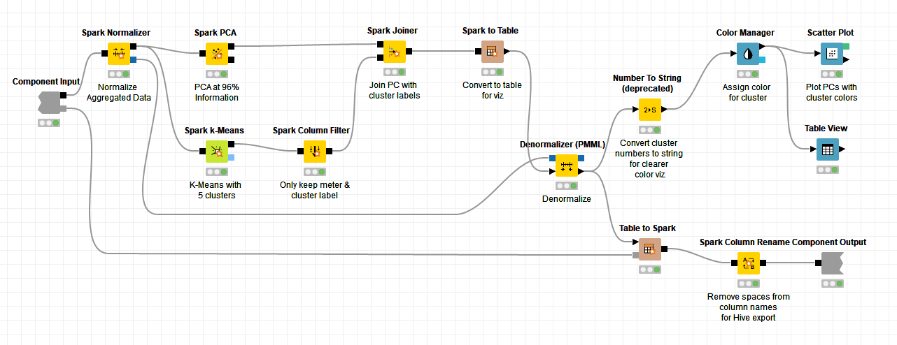

# Business Understanding

# Data Understanding
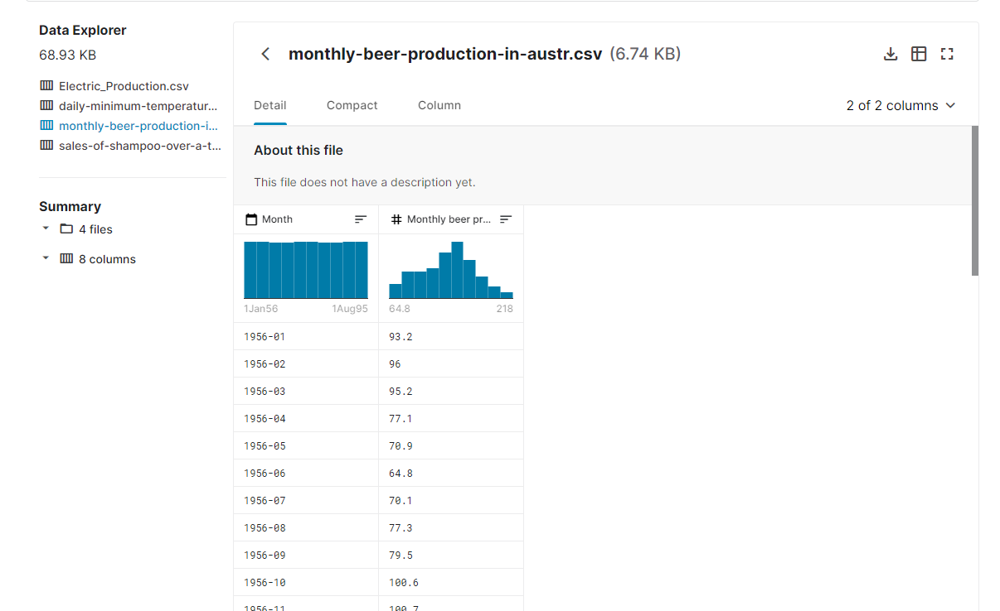

Merupakan dataset yang isinya pencatatan produksi beer setiap bulan

Dataset yang digunakan terdapat 2 attribut utama

 - **Month**: Bulan Produksi beer
 - **monthly_beer_production**: Satuan produksi beer setiap bulannya

# Data Preparation

1. Read 
Untuk dataset sudah disiapkan sebelumnya `daily-minimum-temperatures-in-me.csv`
Data di buka dan di baca menggunakan node **File Reader**

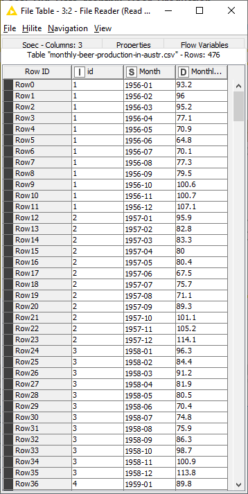

2. Menambahkan Bigdata Environtment
Digunakan untuk kebutuhan terkait pemrosesan data secara masal

# Modeling
Karena Kebutuhan pengolahan data/ Query data maka untuk step Modeling data akan diubah menjadi format yang lain yaitu dataframe

Pertama Tama kita tambahkan node **Create Local Big Data Environment** ,karena kebutuhan penggunaan spark 

Dataset yang sebelumnya sudah diload ke **File Reader**, akan diload ke HIVE menggunakan metanode **Load Data**.
Jadi untuk dataset yang sebelumnya di baca oleh node **FIle Reader** akan di load ke dalam HIVE menggunakan meta node **Load Data** 

Di dalam metanode Load Data, terdapat 2 proses lagi, yaitu **DB Table Creator** dan **DB Loader**.
Pada node **DB Table Creator**, table HIVE diberi nama **beer**

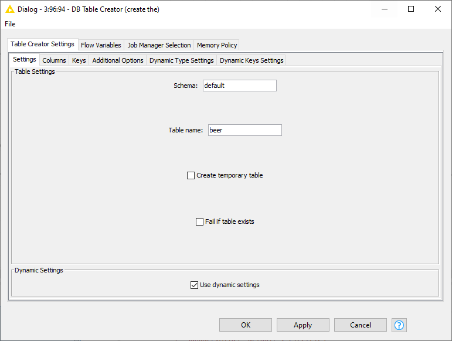

Node **DB Table Creator** memerlukan 2 input, yaitu: 

 - **kotak merah** (DB Connection dimana disini menggunakan Spark HIVE)
 -  **segitiga garis hitam** (berasal dari File Reader)

Sedangkan untuk output-nya adalah kotak merah yang menandakan DB Connection yang telah berhasil dibuat.

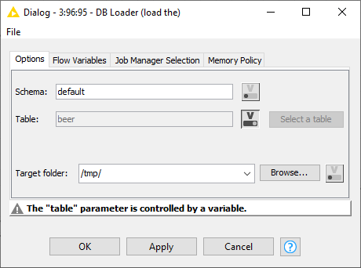

Lalu pada node **DB Loader**, memerlukan 3 input yaitu:

 - **segitiga hitam** (berasal dari File Reader).
 - **kotak merah** (DB Connection dari DB Table Creator).
 - **kotak garis biru** (Koneksi HIVE dari node Create Local Big Data Environment).

dan 1 output, yaitu:

 - **kotak coklat** (data yang telah berbentuk HIVE).

Ketika dijalankan akan mendapat hasil seperti ini

Node **Hive to Spark** digunakan untuk mengimportkan data ke dalam bentuk dataframe

Node **Hive to Spark** memerlukan 2 input, yaitu:

 - **kotak coklat** (data dari node DB Loader yang benbentuk HIVE)
 - **kotak abu-abu** (Spark context dari node Create Local Big Data Environment)

dan 1 output, yaitu:

 - **kotak hitam** (data yang telah berbentuk DataFrame/RDD)

# Evaluation
Pada proses evaluation ini, kita akan mengimplementasikan business understanding-nya

# Deployment
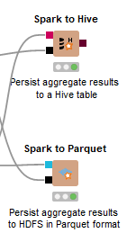

Untuk deployment sendiri, data dari step Evaluation akan di deploy ke dalam HIVE menggunakan **Spark to Hive** dan Parquet menggunakan **Spark to Parquet**, **Spark to Parquet** berfungsi untuk mengubah format data yang awalnya adalah **DataFrame/RDD** menjadi format **file Parquet**, Berikut merupakan konfigurasi dari **Spark to Hive** 

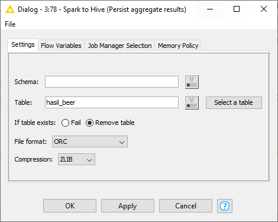

Tabel akan diberi nama **hasil_beer**

Berikut merupakankonfigurasi untuk **Spark to Parquet**

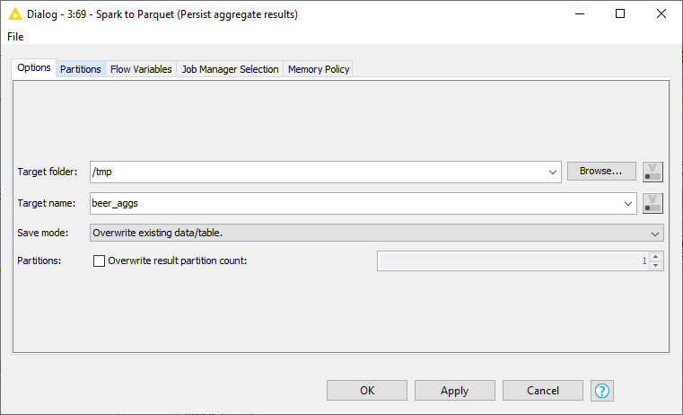

Untuk hasilnya sendiri akan disimpan pada direktori **/beer_aggs**. 
Berikut adalah hasilnya:

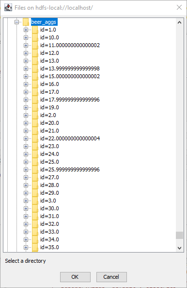